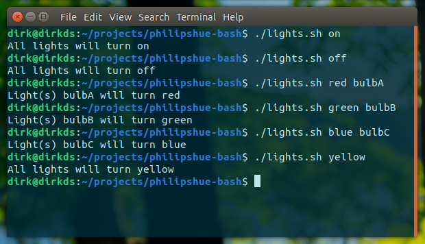

# philipshue-bash
Simple Philips Hue commands in a Bash script.

There are no special dependencies required to run this script, it only makes use of **curl** - which is most probably already pre-installed on your *nix system.


**Example usage:**
```
./lights.sh on
./lights.sh off
./lights.sh red
./lights.sh green
./lights.sh blue

./lights.sh yellow bulbC
./lights.sh purple c
...
```
Philips Hue API doc: https://developers.meethue.com/develop/get-started-2/

Please read on the link above how to retrieve your bridge's **IP** and your own **API key** (username).
You'll need to fill in those variables first, before running this script.

*Personally, I use the content of this script as a function in my `/home/dirk/.bashrc` file, so I can swiftly manage my lights from any terminal.*


